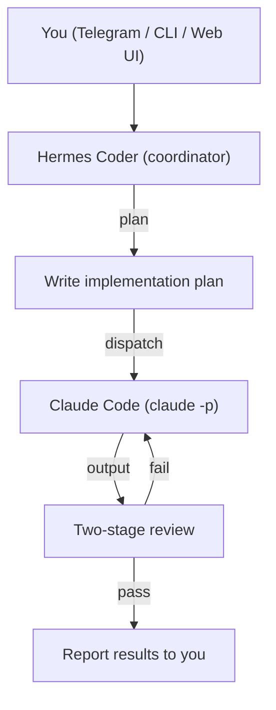

# Building an Always-On AI Coding Agent Server with Hermes and Claude Code

**How to turn a spare Mac into an autonomous coding coordinator that plans, delegates, and reviews code, accessible from anywhere via Telegram**

---

## What we're building

This is a dedicated AI coding agent server using [Nous Research's Hermes Agent](https://hermes-agent.nousresearch.com/) as a coordinator and [Claude Code](https://docs.anthropic.com/en/docs/claude-code) as the implementation engine. The result is an always-on system you can message from your phone with a coding task, and it will:

1. Create a detailed implementation plan with small, independently testable tasks
2. Dispatch each task to Claude Code for implementation
3. Review the output in two stages (spec compliance, then code quality)
4. Report results back to you

The coordinator never writes code itself. It plans, delegates, and reviews. Claude Code does all the actual coding.

### Architecture



### What you'll need

- A Mac (or spare computer or Docker container) that can stay on. My spare Mac is Intel-based, so there's no way to use a GPU for local models. If you have an Apple Silicon Mac, you could use local models like Gemma 4 to keep your token costs down.
- API keys for the models you're using. I use Gemini and Claude, so I have keys for both. See the [Hermes docs](https://hermes-agent.nousresearch.com/) for all supported models.
- While this guide uses [Claude Code](https://docs.anthropic.com/en/docs/claude-code) as the implementation engine, you could substitute any coding agent that supports a non-interactive mode, such as [Gemini CLI](https://github.com/google-gemini/gemini-cli), [Goose](https://github.com/block/goose), or [OpenCode](https://github.com/opencode-ai/opencode).
- A Telegram account (for remote access)
- A GitHub account (for config backup)

---

## Part 1: Preparing the Mac

### 1.1 Prevent sleep

Your Mac needs to stay awake 24/7. Run these commands to disable sleep on both AC power and battery:

```bash
# AC Power — disable all sleep
sudo pmset -c sleep 0
sudo pmset -c disksleep 0

# Battery — disable all sleep (important if power goes out briefly)
sudo pmset -b sleep 0
sudo pmset -b disksleep 0
```

Verify with:

```bash
pmset -g custom
```

Both AC and Battery sections should show `sleep 0` and `disksleep 0`.

### 1.2 Install prerequisites

**Node.js** (for Claude Code):

```bash
brew install node
```

**Claude Code CLI**:

```bash
npm install -g @anthropic-ai/claude-code
```

Authenticate Claude Code or the tool you choose (choose one):

```bash
# Anthropic API key
claude auth login --console
```

Verify it works:

```bash
claude auth status --text
claude -p 'Say hello'
```

---

## Part 2: Installing Hermes Agent

### 2.1 Install Hermes

```bash
curl -fsSL https://raw.githubusercontent.com/NousResearch/hermes-agent/main/scripts/install.sh | bash
```

This installs Hermes to `~/.hermes/` with its own Python virtual environment.

### 2.2 Set up the primary instance

The primary Hermes instance at `~/.hermes/` is your general-purpose personal agent. The coding coordinator is a separate instance, covered in Part 3. This two-agent approach is optional. It's how I have my environment set up, but you could create just a single coding agent without the general-purpose one. They're independent of each other.

**Configure your API key:**

Edit `~/.hermes/.env`:

```bash
# For Gemini:
GOOGLE_API_KEY=your-google-api-key-here

# Or for Anthropic:
# ANTHROPIC_API_KEY=your-anthropic-api-key-here

# Or for OpenAI-compatible:
# OPENAI_API_KEY=your-key-here
```

**Configure the model:**

Edit `~/.hermes/config.yaml`. For Gemini:

```yaml
model:
  default: gemini-3.5-flash
  provider: gemini
```

For Anthropic (Claude):

```yaml
model:
  default: claude-sonnet-4-6
  provider: anthropic
```

### 2.3 Set up Telegram access

1. Open Telegram and message [@BotFather](https://t.me/BotFather)
2. Send `/newbot`
3. Name your bot (e.g., "My Hermes Bot")
4. Choose a username (e.g., `my_hermes_bot`)
5. Copy the bot token

Find your Telegram user ID by messaging [@userinfobot](https://t.me/userinfobot). It will reply with your numeric ID.

Add to `~/.hermes/.env`:

```bash
TELEGRAM_BOT_TOKEN=your-bot-token-here
TELEGRAM_ALLOWED_USERS=your-user-id-here
```

### 2.4 Start and test the primary gateway

```bash
hermes gateway run
```

Message your bot in Telegram. It should respond. Press `Ctrl+C` to stop once verified.

### 2.5 Auto-start on login

Hermes can register itself as a LaunchAgent:

```bash
hermes gateway install
```

This creates `~/Library/LaunchAgents/ai.hermes.gateway.plist` with `RunAtLoad=true` and auto-restart on failure. The gateway will start automatically whenever you log into the Mac.

---

## Part 3: Creating the coding coordinator

This is the core of the setup: a second Hermes instance dedicated to coding. It coordinates work and delegates all implementation to Claude Code.

### 3.1 Create the directory structure

```bash
mkdir -p ~/.hermes-coder/skills/coding-team/{architect,implementer,quality,security,docs,devops,reviewer}
mkdir -p ~/.hermes-coder/skills/workflow/{writing-plans,subagent-driven-development,test-driven-development,requesting-code-review}
mkdir -p ~/.hermes-coder/logs
mkdir -p ~/.hermes-coder/scripts
```

### 3.2 Configure the coder instance

Create `~/.hermes-coder/config.yaml`:

```yaml
model:
  default: gemini-3.5-flash
  provider: gemini
providers: {}
fallback_providers: []
toolsets:
- hermes-cli
agent:
  max_turns: 80
  gateway_timeout: 1800
  restart_drain_timeout: 180
  api_max_retries: 3
  tool_use_enforcement: auto
  gateway_timeout_warning: 900
  clarify_timeout: 600
  gateway_notify_interval: 180
  gateway_auto_continue_freshness: 3600
  image_input_mode: auto
  verbose: false
  reasoning_effort: medium
terminal:
  backend: local
  timeout: 300
  persistent_shell: true
  lifetime_seconds: 600
compression:
  enabled: true
  threshold: 0.5
  target_ratio: 0.2
  protect_last_n: 20
  protect_first_n: 3
prompt_caching:
  cache_ttl: 5m
auxiliary:
  vision:
    provider: gemini
    model: gemini-3.5-flash
    timeout: 30
  web_extract:
    provider: gemini
    model: gemini-3.5-flash
    timeout: 360
  session_search:
    provider: gemini
    model: gemini-3.5-flash
    timeout: 30
display:
  compact: false
  personality: technical
  streaming: true
  inline_diffs: true
  file_mutation_verifier: true
  tool_progress: all
delegation:
  model: gemini-3.5-flash
  provider: gemini
  inherit_mcp_toolsets: true
  max_iterations: 50
  child_timeout_seconds: 600
  max_concurrent_children: 8
  max_spawn_depth: 1
  orchestrator_enabled: true
skills:
  external_dirs: []
  template_vars: true
approvals:
  mode: manual
  timeout: 60
context:
  engine: compressor
memory:
  memory_enabled: true
  user_profile_enabled: true
logging:
  level: INFO
  max_size_mb: 5
model_aliases:
  flash:
    model: gemini-3.5-flash
    provider: gemini
  pro:
    model: gemini-3.5-flash
    provider: gemini
```

> **Using Anthropic instead of Gemini?** Replace all `gemini` references with `anthropic` and model names with Claude model IDs (e.g., `claude-sonnet-4-20250514`).

**Key settings that differ from the primary instance:**
- `max_turns: 80` — coding tasks need more turns
- `max_concurrent_children: 8` — supports the full team of role skills
- `terminal.timeout: 300` — Claude Code tasks can take longer
- `terminal.lifetime_seconds: 600` — keep shells alive for longer tasks

### 3.3 Set up the environment

Create `~/.hermes-coder/.env`:

```bash
GOOGLE_API_KEY=your-google-api-key-here
TELEGRAM_BOT_TOKEN=your-coder-bot-token-here
TELEGRAM_ALLOWED_USERS=your-user-id-here
```

You'll need a **second Telegram bot** for the coding instance (create another one via @BotFather). This keeps personal and coding conversations separate. Just follow the process noted above.

### 3.4 Create the coordinator persona

Create `~/.hermes-coder/SOUL.md`:

```markdown
# Coding Coordinator

You are a senior engineering lead who coordinates software development projects. You plan, decompose, delegate, and review — but you **never write code directly**.

## Core Principles

1. **Plan first.** Before any coding begins, create an implementation plan using the writing-plans skill. Break work into bite-sized, independently testable tasks.

2. **Delegate all coding to Claude Code.** Use `claude -p` via the terminal tool for every implementation task. Never write code in your own responses.

3. **Review everything.** After each Claude Code task completes, review the output in two stages:
   - **Spec review**: Does the output match what was requested? (Quality role skill)
   - **Code quality review**: Is it clean, tested, secure, and maintainable? (Reviewer role skill)

4. **Communicate clearly.** Keep the user informed of progress. Report what was planned, what was done, what passed review, and what needs attention.

## Workflow

When given a coding task:

1. **Understand** — Ask clarifying questions if the request is ambiguous
2. **Plan** — Use the writing-plans skill to create a detailed implementation plan
3. **Execute** — For each task in the plan:
   - Dispatch to Claude Code: `terminal(command="claude -p '<task prompt>' --allowedTools 'Read,Edit,Write,Bash' --max-turns 15", workdir="<project-dir>", timeout=300)`
   - Review the output using Quality and Reviewer role skills
   - If review fails, re-dispatch with feedback
4. **Verify** — Run tests, check for regressions
5. **Report** — Summarize what was accomplished and any remaining items

## Role Skills

You have 7 role skills that shape your perspective when planning or reviewing:

- **Architect** — System design, architecture decisions, dependencies
- **Implementer** — Task execution patterns, Claude Code dispatch templates
- **Quality** — Testing strategy, TDD, metrics, spec compliance
- **Security** — Vulnerability review, dependency audit, secrets handling
- **Docs** — Documentation, changelogs, API docs
- **DevOps** — CI/CD, deployment, infrastructure
- **Reviewer** — Code review, PR management, cross-concern synthesis

Apply the relevant role lens at each stage. For example, consult Architect during planning, Quality during review, Security before merging.

## Claude Code Integration

- **Print mode** (`claude -p`) is the primary integration — one-shot, non-interactive
- Always set `--allowedTools` to limit scope appropriately
- Use `--max-turns` to prevent runaway tasks (default 15, increase for complex work)
- Set `workdir` to the project directory
- For multi-file changes, give Claude Code a clear, self-contained prompt with all context it needs

## What You Do NOT Do

- You do not write code directly in your responses
- You do not modify files yourself — Claude Code does that
- You do not skip the planning phase for non-trivial tasks
- You do not skip review after Claude Code completes a task
```

---

## Part 4: Creating the role skills

The coordinator uses 7 role skills as "lenses" for planning and reviewing work. These are inspired by [Squad](https://github.com/bradygaster/squad), a framework for scaffolding teams of specialist AI agents, adapted into 7 roles that fit the coordinator's review workflow.

Each skill is a SKILL.md file in Hermes skill format: YAML frontmatter followed by markdown content.

### 4.1 Architect

Create `~/.hermes-coder/skills/coding-team/architect/SKILL.md`:

```markdown
---
name: architect
description: "System design, architecture decisions, dependency analysis for coding projects."
version: 1.0.0
author: Hermes Coder
license: MIT
platforms: [linux, macos, windows]
metadata:
  hermes:
    tags: [architecture, design, planning, dependencies, system-design]
    related_skills: [implementer, quality, reviewer]
---

# Architect Role

Apply this lens when making system design decisions, evaluating architecture, or analyzing dependencies.

## Charter

**Identity:** Senior software architect responsible for system-level design decisions.

**Expertise:**
- System architecture and design patterns
- Dependency analysis and management
- API design and interface contracts
- Performance and scalability considerations
- Technology selection and trade-off analysis

**Responsibilities:**
- Define system boundaries and component interfaces
- Evaluate architectural trade-offs and document decisions
- Identify coupling, circular dependencies, and design smells
- Ensure new work fits within the existing architecture
- Flag when architectural changes need broader discussion

## Review Checklist

When reviewing work through the Architect lens:

- [ ] Does the change respect existing architectural boundaries?
- [ ] Are new dependencies justified and minimal?
- [ ] Are interfaces clean and well-defined?
- [ ] Is the change consistent with established patterns in the codebase?
- [ ] Are there performance or scalability concerns?
- [ ] Does the design handle error cases and edge conditions?
- [ ] Is the change backward-compatible where needed?

## Claude Code Prompt Template

When dispatching architecture-related tasks:

    Analyze the architecture of <project-dir>. Focus on:
    1. Module structure and dependencies
    2. Interface boundaries between components
    3. Design patterns in use
    4. Areas of coupling or complexity

    Provide a concise architecture summary with recommendations.
```

### 4.2 Implementer

Create `~/.hermes-coder/skills/coding-team/implementer/SKILL.md`:

```markdown
---
name: implementer
description: "Task execution templates and Claude Code dispatch patterns for coding tasks."
version: 1.0.0
author: Hermes Coder
license: MIT
platforms: [linux, macos, windows]
metadata:
  hermes:
    tags: [implementation, coding, dispatch, execution, claude-code]
    related_skills: [architect, quality, writing-plans]
---

# Implementer Role

Apply this lens when dispatching coding tasks to Claude Code and structuring implementation prompts.

## Charter

**Identity:** Implementation specialist who translates plans into precise Claude Code dispatch prompts.

**Expertise:**
- Breaking plans into atomic, independently testable tasks
- Writing clear, self-contained prompts for Claude Code
- Managing execution order and dependencies between tasks
- Handling failures, retries, and escalation

**Responsibilities:**
- Convert plan tasks into Claude Code `-p` prompts
- Set appropriate `--allowedTools`, `--max-turns`, and `timeout` per task
- Include all necessary context in each prompt (file paths, function signatures, test commands)
- Monitor output for signs of task going off-track
- Retry with refined prompts on failure before escalating

## Dispatch Patterns

### Simple file edit
    terminal(command="claude -p 'In <file>, update <function> to <change>. Run existing tests to verify.' --allowedTools 'Read,Edit,Bash' --max-turns 10", workdir="<project>", timeout=120)

### New feature implementation
    terminal(command="claude -p 'Implement <feature> as described: <spec>. Create files in <location>. Write tests in <test-location>. Follow existing patterns in <example-file>.' --allowedTools 'Read,Edit,Write,Bash' --max-turns 20", workdir="<project>", timeout=300)

### Bug fix
    terminal(command="claude -p 'Fix bug: <description>. Reproduce with: <repro-steps>. Root cause is likely in <file>. Add a regression test.' --allowedTools 'Read,Edit,Bash' --max-turns 15", workdir="<project>", timeout=180)

## Escalation Framework

1. **First failure:** Re-dispatch with more context and explicit constraints
2. **Second failure:** Simplify the task — break it into smaller pieces
3. **Third failure:** Escalate to user with findings and ask for guidance
```

### 4.3 Quality

Create `~/.hermes-coder/skills/coding-team/quality/SKILL.md`:

```markdown
---
name: quality
description: "Testing strategy, TDD enforcement, spec compliance, and regression checks."
version: 1.0.0
author: Hermes Coder
license: MIT
platforms: [linux, macos, windows]
metadata:
  hermes:
    tags: [testing, quality, tdd, spec-compliance, regression, metrics]
    related_skills: [implementer, reviewer, test-driven-development]
---

# Quality Role

Apply this lens when reviewing code for spec compliance, testing adequacy, and quality standards.

## Spec Compliance Review

After Claude Code completes a task, verify:

- [ ] All requirements from the task spec are implemented
- [ ] No requirements are partially implemented or skipped
- [ ] No unrequested changes were made (scope creep)
- [ ] Output format matches what was specified
- [ ] Error handling matches spec (not over- or under-engineered)

## Testing Review

- [ ] New code has corresponding tests
- [ ] Tests cover the happy path
- [ ] Tests cover edge cases and error conditions
- [ ] Tests are deterministic (no flaky tests)
- [ ] Existing tests still pass
- [ ] Test names clearly describe what they verify
```

### 4.4 Security

Create `~/.hermes-coder/skills/coding-team/security/SKILL.md`:

```markdown
---
name: security
description: "Security review, vulnerability scanning, and dependency audit for code changes."
version: 1.0.0
author: Hermes Coder
license: MIT
platforms: [linux, macos, windows]
metadata:
  hermes:
    tags: [security, vulnerability, audit, dependencies, secrets]
    related_skills: [quality, reviewer, architect]
---

# Security Role

Apply this lens when reviewing code for security concerns.

## Security Review Checklist

- [ ] No hardcoded secrets, API keys, or credentials
- [ ] No SQL injection vectors (parameterized queries used)
- [ ] No XSS vectors (output properly escaped)
- [ ] No command injection (user input not passed to shell)
- [ ] Input validated at system boundaries
- [ ] Authentication checks present where required
- [ ] Authorization checks enforce least privilege
- [ ] Dependencies have no known critical CVEs
- [ ] Sensitive data not logged or exposed in error messages
- [ ] File operations use safe paths (no path traversal)
```

### 4.5 Docs

Create `~/.hermes-coder/skills/coding-team/docs/SKILL.md`:

```markdown
---
name: docs
description: "Documentation, changelogs, API docs, and README maintenance."
version: 1.0.0
author: Hermes Coder
license: MIT
platforms: [linux, macos, windows]
metadata:
  hermes:
    tags: [documentation, changelog, api-docs, readme, writing]
    related_skills: [reviewer, implementer, architect]
---

# Docs Role

Apply this lens when evaluating documentation needs.

## Documentation Review Checklist

- [ ] Public APIs have clear documentation
- [ ] README reflects any setup or usage changes
- [ ] Breaking changes are documented with migration notes
- [ ] New features have usage examples
- [ ] Configuration options are documented
- [ ] Changelog entry added for user-facing changes
```

### 4.6 DevOps

Create `~/.hermes-coder/skills/coding-team/devops/SKILL.md`:

```markdown
---
name: devops
description: "CI/CD, deployment, infrastructure, and environment configuration."
version: 1.0.0
author: Hermes Coder
license: MIT
platforms: [linux, macos, windows]
metadata:
  hermes:
    tags: [cicd, deployment, infrastructure, docker, github-actions]
    related_skills: [architect, security, implementer]
---

# DevOps Role

Apply this lens when evaluating CI/CD changes, deployment configurations, or infrastructure concerns.

## DevOps Review Checklist

- [ ] CI/CD pipelines run all necessary checks (lint, test, build)
- [ ] Docker/container configs are optimized
- [ ] Environment variables documented and not hardcoded
- [ ] Build is reproducible (pinned dependencies, lockfiles)
- [ ] Deployment has rollback capability
- [ ] Secrets managed via proper secret management
```

### 4.7 Reviewer

Create `~/.hermes-coder/skills/coding-team/reviewer/SKILL.md`:

```markdown
---
name: reviewer
description: "Code review, PR management, and cross-concern quality synthesis."
version: 1.0.0
author: Hermes Coder
license: MIT
platforms: [linux, macos, windows]
metadata:
  hermes:
    tags: [code-review, pull-request, quality, synthesis, communication]
    related_skills: [quality, security, architect, docs]
---

# Reviewer Role

Apply this lens for final code review and synthesizing feedback across all concerns.

## Code Review Checklist

### Correctness
- [ ] Code does what the spec says
- [ ] Edge cases handled
- [ ] Error handling appropriate

### Readability
- [ ] Clear naming
- [ ] Consistent style with existing codebase
- [ ] No unnecessary complexity

### Maintainability
- [ ] DRY — no unnecessary duplication
- [ ] YAGNI — no speculative features
- [ ] Single responsibility

### Integration
- [ ] Changes integrate cleanly with existing code
- [ ] No breaking changes to public interfaces (unless intended)
- [ ] Git history is clean

## Final Review Process

1. Read all changed files
2. Apply each role lens (Architect, Quality, Security, Docs, DevOps)
3. Compile findings into a single review
4. Categorize issues: **blocking** (must fix), **suggestion** (should fix), **nit** (nice to fix)
5. Report to user with clear summary
```

---

## Part 5: Creating the workflow skills

These skills define the coordinator's development methodology, adapted from the [Superpowers](https://github.com/obra/superpowers) project. The key adaptation: instead of using Hermes's `delegate_task` for subagents, the coordinator dispatches work to Claude Code via `claude -p`.

### 5.1 Writing plans

Create `~/.hermes-coder/skills/workflow/writing-plans/SKILL.md`:

```markdown
---
name: writing-plans
description: "Write implementation plans: bite-sized tasks for Claude Code dispatch."
version: 2.0.0
author: Hermes Coder (adapted from obra/superpowers)
license: MIT
platforms: [linux, macos, windows]
metadata:
  hermes:
    tags: [planning, design, implementation, workflow, documentation]
    related_skills: [subagent-driven-development, test-driven-development, requesting-code-review]
---

# Writing Implementation Plans

## Overview

Write comprehensive implementation plans assuming the implementer (Claude Code) has zero context for the codebase. Document everything: which files to touch, complete code, testing commands, docs to check, how to verify. Give them bite-sized tasks. DRY. YAGNI. TDD. Frequent commits.

Claude Code receives each task as a self-contained `-p` prompt — it cannot see the plan or prior tasks. Every task must be fully self-contained.

**Core principle:** A good plan makes implementation obvious.

## Task Structure

Each task follows this format:

    ### Task N: [Descriptive Name]

    **Objective:** What this task accomplishes (one sentence)

    **Files:**
    - Create: `exact/path/to/new_file.py`
    - Modify: `exact/path/to/existing.py`
    - Test: `tests/path/to/test_file.py`

    **Claude Code Prompt:**
    [The exact prompt to pass to claude -p, including all context needed]

    **Allowed Tools:** Read, Edit, Write, Bash
    **Max Turns:** 15
    **Timeout:** 180

    **Verification:**
    Run: `pytest tests/path/test.py -v`
    Expected: PASS

## Principles

- **Self-Contained Prompts** — Claude Code has no memory between dispatches
- **DRY** — Don't Repeat Yourself
- **YAGNI** — You Aren't Gonna Need It
- **TDD** — Test-Driven Development for every code-producing task

**A good plan makes implementation obvious.**
```

### 5.2 Claude Code-driven development

Create `~/.hermes-coder/skills/workflow/subagent-driven-development/SKILL.md`:

```markdown
---
name: subagent-driven-development
description: "Execute plans via Claude Code dispatches with two-stage review."
version: 2.0.0
author: Hermes Coder (adapted from obra/superpowers)
license: MIT
platforms: [linux, macos, windows]
metadata:
  hermes:
    tags: [claude-code, implementation, workflow, review, dispatch]
    related_skills: [writing-plans, requesting-code-review, test-driven-development]
---

# Claude Code-Driven Development

## Overview

Execute implementation plans by dispatching Claude Code (`claude -p`) per task with systematic two-stage review by the coordinator.

**Core principle:** Fresh Claude Code dispatch per task + coordinator two-stage review (spec then quality) = high quality, fast iteration.

## Per-Task Workflow

### Step 1: Dispatch Claude Code

    terminal(
        command="claude -p '<self-contained task prompt>' --allowedTools 'Read,Edit,Write,Bash' --max-turns 15",
        workdir="<project-directory>",
        timeout=300
    )

### Step 2: Spec Compliance Review (Coordinator)

- [ ] All requirements implemented
- [ ] No scope creep
- [ ] File paths and signatures match spec

**If issues found:** Re-dispatch with fix instructions, then re-review.

### Step 3: Code Quality Review (Coordinator)

- [ ] Follows project conventions
- [ ] Proper error handling
- [ ] Adequate test coverage
- [ ] No security issues

Categorize: **blocking** / **suggestion** / **nit**

### Step 4: Mark Complete

## Escalation

1. **First failure:** Re-dispatch with more context
2. **Second failure:** Break task into smaller pieces
3. **Third failure:** Escalate to user

## Red Flags

- Never skip reviews
- Never dispatch tasks that touch the same files in parallel
- Never let Claude Code reference "the plan" (it can't see it)
- Never start quality review before spec compliance passes

**Quality is not an accident. It's the result of systematic process.**
```

### 5.3 Test-driven development

Create `~/.hermes-coder/skills/workflow/test-driven-development/SKILL.md`:

```markdown
---
name: test-driven-development
description: "TDD: enforce RED-GREEN-REFACTOR in Claude Code dispatches."
version: 2.0.0
author: Hermes Coder (adapted from obra/superpowers)
license: MIT
platforms: [linux, macos, windows]
metadata:
  hermes:
    tags: [testing, tdd, development, quality, red-green-refactor]
    related_skills: [writing-plans, subagent-driven-development, requesting-code-review]
---

# Test-Driven Development (TDD)

## The Iron Law

    NO PRODUCTION CODE WITHOUT A FAILING TEST FIRST

## Red-Green-Refactor Cycle

1. **RED** — Write a failing test
2. **Verify RED** — Run it, confirm it fails because the feature is missing
3. **GREEN** — Write minimal code to pass
4. **Verify GREEN** — Run specific test (pass) + all tests (no regressions)
5. **REFACTOR** — Clean up, keep tests green
6. **Repeat**

## Claude Code Integration

Every implementation prompt must include TDD instructions:

    claude -p 'Implement <feature> using strict TDD:
    1. Write a failing test FIRST in <test-file>
    2. Run the test to verify it fails: <test-command>
    3. Write minimal code to make the test pass
    4. Run the test to verify it passes
    5. Run the full test suite for regressions: <full-test-command>
    6. Refactor if needed (keep tests green)
    7. Commit
    ' --allowedTools 'Read,Edit,Write,Bash' --max-turns 15
```

### 5.4 Requesting code review

Create `~/.hermes-coder/skills/workflow/requesting-code-review/SKILL.md`:

```markdown
---
name: requesting-code-review
description: "Pre-commit verification: security scan, quality gates, Claude Code review."
version: 2.0.0
author: Hermes Coder (adapted from obra/superpowers)
license: MIT
platforms: [linux, macos, windows]
metadata:
  hermes:
    tags: [code-review, security, verification, quality, pre-commit]
    related_skills: [subagent-driven-development, writing-plans, test-driven-development]
---

# Pre-Commit Code Verification

**Core principle:** No agent should verify its own work. Fresh context finds what you miss.

## Pipeline

1. **Get the diff** — `git diff --cached` or `git diff HEAD~1 HEAD`
2. **Static security scan** — grep for hardcoded secrets, injection vectors
3. **Run tests and linting** — compare against baseline for regressions only
4. **Self-review** — coordinator checks with Reviewer role skill
5. **Independent Claude Code review** — dispatch a fresh Claude Code instance to review the diff
6. **Evaluate** — combine all results
7. **Fix loop** (max 2 cycles) — dispatch fixes for any issues
8. **Commit** — `git commit -m '[verified] <description>'`

The `[verified]` prefix indicates independent review approved the change.
```

---

## Part 6: Auto-start and service management

### 6.1 Create the coder LaunchAgent

Create `~/Library/LaunchAgents/ai.hermes-coder.gateway.plist`:

```xml
<?xml version="1.0" encoding="UTF-8"?>
<!DOCTYPE plist PUBLIC "-//Apple//DTD PLIST 1.0//EN" "http://www.apple.com/DTDs/PropertyList-1.0.dtd">
<plist version="1.0">
<dict>
    <key>Label</key>
    <string>ai.hermes-coder.gateway</string>

    <key>ProgramArguments</key>
    <array>
        <string>/Users/YOUR_USERNAME/.hermes/hermes-agent/venv/bin/python</string>
        <string>-m</string>
        <string>hermes_cli.main</string>
        <string>gateway</string>
        <string>run</string>
        <string>--replace</string>
    </array>

    <key>WorkingDirectory</key>
    <string>/Users/YOUR_USERNAME/.hermes/hermes-agent</string>

    <key>EnvironmentVariables</key>
    <dict>
        <key>PATH</key>
        <string>/Users/YOUR_USERNAME/.hermes/hermes-agent/venv/bin:/usr/local/bin:/usr/bin:/bin:/usr/sbin:/sbin</string>
        <key>VIRTUAL_ENV</key>
        <string>/Users/YOUR_USERNAME/.hermes/hermes-agent/venv</string>
        <key>HERMES_HOME</key>
        <string>/Users/YOUR_USERNAME/.hermes-coder</string>
    </dict>

    <key>RunAtLoad</key>
    <true/>

    <key>KeepAlive</key>
    <dict>
        <key>SuccessfulExit</key>
        <false/>
    </dict>

    <key>StandardOutPath</key>
    <string>/Users/YOUR_USERNAME/.hermes-coder/logs/gateway.log</string>

    <key>StandardErrorPath</key>
    <string>/Users/YOUR_USERNAME/.hermes-coder/logs/gateway.error.log</string>
</dict>
</plist>
```

> Replace `YOUR_USERNAME` with your actual macOS username throughout.

`HERMES_HOME` tells the shared Hermes installation to use the coder configuration instead of the default.

### 6.2 Load the LaunchAgent

```bash
launchctl load ~/Library/LaunchAgents/ai.hermes-coder.gateway.plist
```

Verify both gateways are running:

```bash
launchctl list | grep hermes
```

You should see two entries with exit code 0:

```
12345  0  ai.hermes.gateway
12346  0  ai.hermes-coder.gateway
```

### 6.3 Add a shell alias

Add to your `~/.zshrc` (or `~/.bashrc`):

```bash
alias coder='HERMES_HOME=~/.hermes-coder hermes'
```

Now you can type `coder` in any terminal to interact with the coding coordinator via CLI.

---

## Part 7: Backup to GitHub

### 7.1 Create a private repository

Go to [github.com/new](https://github.com/new) and create a private repository (e.g., `my-hermes-coder-backup`). Don't initialize it with any files.

### 7.2 Create a personal access token

Go to [GitHub Settings > Developer Settings > Personal Access Tokens > Fine-grained tokens](https://github.com/settings/tokens?type=beta). Create a token with:
- Repository access: Only the backup repo
- Permissions: Contents (Read and Write)

### 7.3 Initialize, push, and schedule nightly backups

Once you have the repo and token, ask your primary Hermes instance to set everything up. Message it via Telegram or CLI:

> Initialize `~/.hermes-coder` as a git repo and push it to `https://github.com/YOUR_USERNAME/my-hermes-coder-backup.git` using personal access token `YOUR_PAT`. Create a `.gitignore` that excludes secrets (`.env`, `auth.json`, `*.key`, `*.pem`, `*.token`), runtime files (`*.db`, `*.db-wal`, `*.db-shm`, `logs/`, `gateway_state.json`, `gateway.lock`, `gateway.pid`, `.tick.lock`), runtime directories (`sessions/`, `sandboxes/`, `pairing/`, `bin/`), caches (`audio_cache/`, `media/`, `image_cache/`, `models_dev_cache.json`, `channel_directory.json`), `node_modules/`, and `.DS_Store`. After the initial push, create a backup script at `~/.hermes-coder/scripts/backup.sh` that checks for changes, commits with a timestamp, and pushes to origin. Then set up a Hermes cron job to run the backup script every night at 12:30 AM.

Hermes will create the `.gitignore`, initialize the repo, push the initial commit, write the backup script, and configure the scheduled job. Verify the backup ran by checking the commit history in your private GitHub repo the next morning.

---

## Part 8: Web UIs (optional but recommended)

### 8.1 Hermes WebUI

A three-panel web interface with session management, file browser, and git integration.

```bash
cd ~/projects  # or wherever you keep repos
git clone https://github.com/nesquena/hermes-webui.git
cd hermes-webui

# Create .env with a password
cat > .env << 'EOF'
HERMES_WEBUI_PASSWORD=your-secure-password-here
HERMES_WEBUI_HOST=127.0.0.1
HERMES_WEBUI_PORT=8787
EOF

# Start for the primary agent
python3 bootstrap.py --skip-agent-install --no-browser

# Start for the coder agent (separate terminal or background)
HERMES_HOME=~/.hermes-coder HERMES_WEBUI_STATE_DIR=~/.hermes-coder/webui \
  python3 bootstrap.py 8788 --skip-agent-install --no-browser
```

- Primary agent: http://localhost:8787
- Coder agent: http://localhost:8788

> **Security note:** Always set `HERMES_WEBUI_PASSWORD`. Use `--skip-agent-install` to avoid the bootstrap's `curl | bash` install step.

---

## Part 9: Using the coding coordinator

### Via Telegram

Message your coder bot with a task:

> "Clone https://github.com/user/repo to ~/projects/repo and add input validation to the login form"

The coordinator will:
1. Clone the repo
2. Explore the codebase
3. Create an implementation plan
4. Dispatch Claude Code for each task
5. Review the output
6. Report back

### Via CLI

```bash
coder
# Or:
HERMES_HOME=~/.hermes-coder hermes
```

### Via Web UI

Open http://localhost:8788 and chat with the coder agent in your browser.

### Giving it a project directory

Always include the project path in your request:

> "In `/Users/me/projects/my-app`, refactor the database layer to use connection pooling"

The coordinator passes this as the `workdir` when dispatching Claude Code.

---

## Troubleshooting

### Gateway won't start

Check the error log:

```bash
cat ~/.hermes-coder/logs/gateway.error.log | tail -20
```

### Gateway exits and doesn't restart

The `KeepAlive` config only restarts on non-zero exit. If the gateway exits cleanly (code 0), reload:

```bash
launchctl unload ~/Library/LaunchAgents/ai.hermes-coder.gateway.plist
launchctl load ~/Library/LaunchAgents/ai.hermes-coder.gateway.plist
```

### Claude Code auth issues

```bash
claude auth status --text
```

If expired, re-authenticate:

```bash
claude auth login --console  # for API key
# or
gcloud auth application-default login  # for Vertex AI
```

### Check both gateways are running

```bash
launchctl list | grep hermes
```

Both should show exit code 0. If one shows exit code 1, check its error log.

### Discord errors in logs

If you see `[Discord] No bot token configured`, that's expected. Hermes tries to connect to all platforms by default. The errors are harmless.

---

## What's next

Once the system is running, you can extend it:

- Add more team members by adding their Telegram user IDs to `TELEGRAM_ALLOWED_USERS` (comma-separated)
- Edit the role skills to match your team's review standards
- Put a `CLAUDE.md` in your project repos so Claude Code follows your project's conventions
- Connect the coordinator to GitHub, Jira, Linear, or other tools via MCP
- Track Gemini API usage for the coordinator and Claude/Vertex usage for Claude Code separately to monitor costs

---

## Credits

- [Nous Research Hermes Agent](https://hermes-agent.nousresearch.com/) — The autonomous agent framework
- [Claude Code](https://docs.anthropic.com/en/docs/claude-code) — Anthropic's coding agent CLI
- [Superpowers](https://github.com/obra/superpowers) — Development methodology skills (writing-plans, TDD, subagent-driven-dev, code review)
- [Squad](https://github.com/bradygaster/squad) — AI agent team scaffolding framework
- [hermes-webui](https://github.com/nesquena/hermes-webui) — Web interface for Hermes
